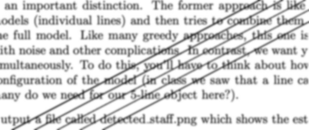
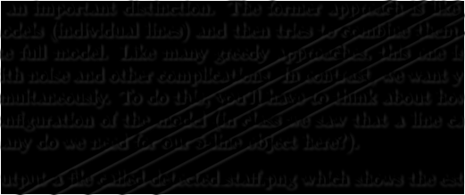
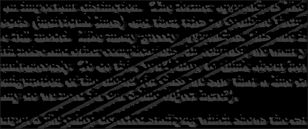
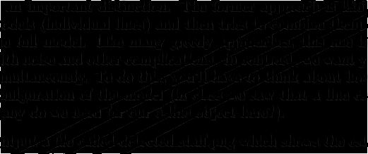
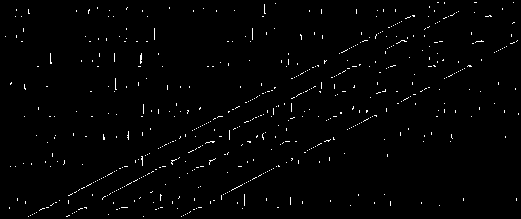
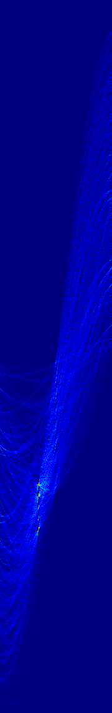
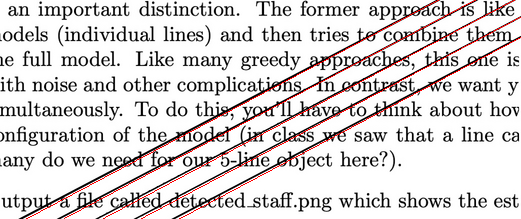
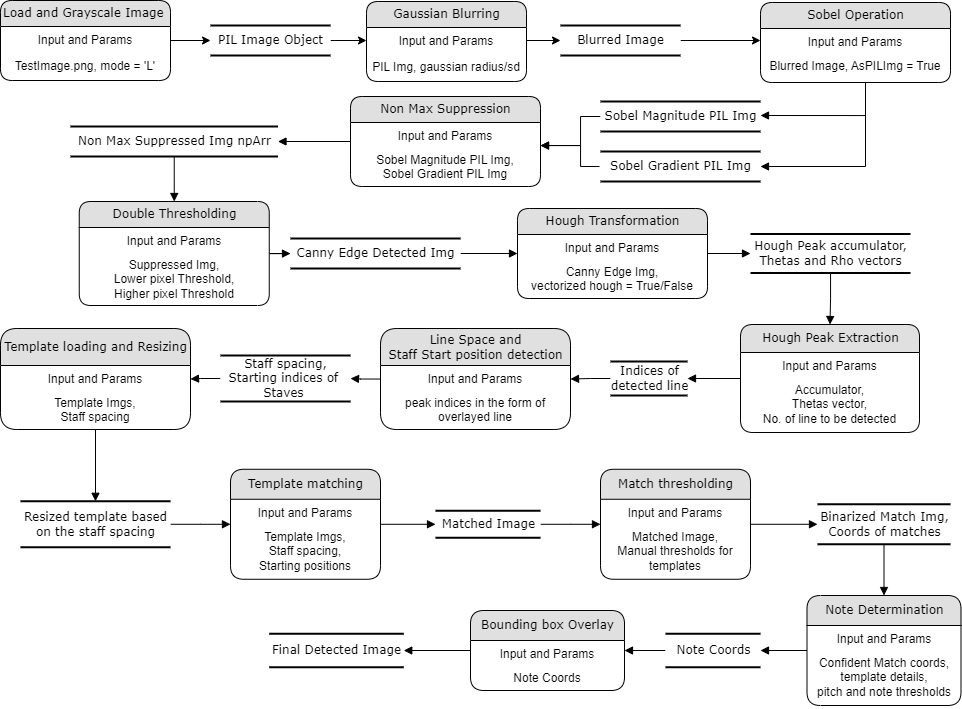

# Part 0
This issue involved a noisy bird image that was produced after some image pre-processing. The goal of this issue is to locate the noise source and determine the kind of noise that was impairing the image quality. There have been many different ways offered and tried out, and we would like to highlight what worked well and how we selected the approach type based on the noise.

Methods that was followed:
1.  Manual Method
2. Band Stop Filter
3. Mean Filter

## Manual Method:
An image can be cleaned of noise in particular frequency range by manually plotting grid so that the source of the noise can be found out through pixel matching. After, finding out the noise range we can reduce the noise by making the combination of pixels to zero. 

### Steps Followed:
1.  We load the image and apply Fourier transform to the image and it is transformed into sines and cosines making it easier to locate the noise in the image.


2. With the fourier transformed image, we can draw a grid and use pixel matching to identify the noise source. With the help of this image, we can determine the image's origin, as well as its pixel composition and noise levels.


3. By bringing the pixel combination to zero, the noise in the image can be erased (zero in this case). In this manner, we completely mask the noise.
4. Then, the fourier picture with the noise removed is inversely transformed to get the original image (without the noise). 


### Observation:
Although the noise cannot be completely eliminated, you can clearly notice that it has been reduced in comparison. A portion of the image pixel that is not supposed to be noise is removed as the noise is decreased. But aside from that, it seems like this approach actually worked!

## Band Stop Filter:
An image can be cleaned of noise in particular frequency ranges using a band-stop filter. It is sometimes referred to as a band-reject filter or a notch filter. A band-stop filter is made to reject some frequencies while allowing others to pass through.
### Steps Followed
1. An image's frequencies are detailed in the frequency domain representation that is produced after Fourier transformation.

2. The noise in the image is then efficiently reduced by applying a band stop filter, which attenuates the amplitudes of the noise frequencies that lie within the set range.

The filter function is typically designed to have a sharp transition between attenuated frequencies and frequencies that remain unchanged. This helps to avoid any distortion of important image features that may be close to the attenuated frequency range.The band-stop filter's parameters, such as the center frequency and notch width, can be tuned to selectively suppress the specific frequencies that correspond to noise while leaving other frequencies unaffected.


3. The Noise detected in the image using the radial distance is masked to zero. This way we can reduce the noise in the image.

4. Then, the Fourier picture with the noise removed is inversely transformed to get the original image


### Observation:

With the above image, we can still see some noises which is not removed completely. Also, the image colors looks to be little dull after the filter. 


## Mean Filter:
A mean filter is a straightforward linear filter that is frequently employed in image processing to reduce noise. It functions by substituting each pixel in an image with the average value of those closest to it. The amount of noise in the image and the desired level of smoothing are often taken into account when determining the neighborhood size, also known as the kernel size.
### Steps Followed
1. An image's frequencies are detailed in the frequency domain representation that is produced after Fourier transformation
2. An image is blurred using the mean filter to reduce noise. The mean of the pixel values within a 5 × 5 kernel must be found. 
3. The mean is then used in place of the center element's pixel intensity. This smooths the image's borders and reduces some of the noise in the image.
4. Then, the Fourier picture with the noise removed is inversely transformed to get the original image.


### Observation:
The above image shows the image after applying the filter. It has removed noise to an extent, but the distinctions are still clearly visible. Due to the filter, the colors appear dull and the image has some degree of blur.

## Challenges
The main challenge is to find a suitable technique the can filter the noise. We tried with mean filter, meadian filter and gaussian filter on the FFT of the image with different size of boxes. Then we tried with implementation of filter on the FFT. We tried with Low pass, Band pass and Ban stop in which we tried with different cut off values for the filter.

## Improvements

An idea is that we can be generate the filter in such a way that the model can automatically find out the cutoff values without human interventaion. 

# Part 1
Part 1 contains one file called as staff_finder.py in which hough transforms is used to identify straight lines present in the image. The functiones in the values of iamge name, does preprocessing in many steps, then calls hough accumulator, finds the lines with an input of number of lines that are to be extracted and overlap the lines on the original image. There are different magic parameters in preprocessing that are found out after many trials.

## Preprocessing
Edge detection involves many steps in preprocessing. First Gaussian Blur is performed on the image, followed by Sobel filter, then Non Maximum Supression and thresholding beforre doing hough transform. This ensures that lines are highliheted predominantly and the background is blurred or removed. This ensures that only the required components of the image that we are concetrating is getting passed over to the transformation. This techiques change for differnt components and parameters change for different images.

### Gaussian Blur
Gaussian Blur is used to blur the image, and reduce the effect of the noise in the hough transform. It reduces the sharpness of the edges in the image which makes it easy in future processes.At first the RGB image is converted into grayscale image. We are using PIL's Gaussian Blur with radius as standard deviation which is a magic parameter and changes with different images and requirements. We observed that as the standard deviation input increased, the image became more blurred and changes other cutoff frequencies.
```sh
def ApplyGaussian(PILimgObj, StandardDev = 1, ShowStage = True, ShowOut = False):
    """
    Module to implement gaussian blur for the image with standard parameter select for the kernel
    Ref: https://pillow.readthedocs.io/en/stable/_modules/PIL/ImageDraw2.html
    """
    if ShowStage: print("*============== Applying Gaussian Filter ==============*\n")
    if PILimgObj.mode != 'L':PILimgObj.convert('L')
        
    NewPILimgObj = PILimgObj.filter(ImageFilter.GaussianBlur(radius = StandardDev))
    
    if ShowOut:
        plt.figure()
        plt.imshow(NewPILimgObj,'gray')
    
    if ShowStage: print("*-------------- Applied Gaussian Filter --------------* \n")
    
    return NewPILimgObj
```
-   The result of the gaussian blur operator on the sample input is:-



### Sobel Filter
Sobel filter is used to extract edges present in an image. It is gradient of the image where the change in intensity of image is recorded. We convolve images with small integer valued filter in horizontal and vertical directions. We calculated both magnitude and phase using the convolution and 3 x3 Sobel filter kernel. Then the images normalized with maximum values of Grayscale image (255). This normalized images are returned to the function call.
We also used if statement that plots the magnitude and phase parts of Sobel transformation if prompted from the function call

``` sh
def ApplySobel(PILimgObj, AsPil = False, ShowStage = True, ShowOut = False):
    
    """
    Module to implement Sobel Operator for the image edge enhancement using seperated kernels
    Ref: https://www.youtube.com/watch?v=qHn9mctee1Q
         https://matplotlib.org/stable/gallery/subplots_axes_and_figures/subplots_demo.html
    """
    if ShowStage: print("*============== Applying Seperable Sobel Filter ==============*\n")
    if PILimgObj.mode != 'L': PILimgObj = PILimgObj.convert('L')
    
    SobelImgGx = PILimgObj.filter(ImageFilter.Kernel((3, 3), sobel_filter_gx,1,0))
    SobelImgGy = PILimgObj.filter(ImageFilter.Kernel((3, 3), sobel_filter_gy,1,0))
    
    SobelMag = np.hypot(np.array(SobelImgGx),np.array(SobelImgGy))
    NormSobelMag = ((SobelMag / np.max(SobelMag)) * MAX_BRIGHTNESS).astype(np.uint8) 
    
    SobelGrad = np.arctan2(np.array(SobelImgGy), np.array(SobelImgGx))
    NormSobelGrad = (SobelGrad * MAX_BRIGHTNESS / (2*np.pi)).astype(np.uint8)
    
    if ShowStage: print("*-------------- Applied Sobel Filters --------------* \n")

    if ShowOut:
        plt.figure()
        fig,(ax1, ax2) = plt.subplots(1,2,figsize = (12,8),layout="tight")
        ax1.imshow(NormSobelMag,'gray')
        ax1.set_title("Sobel Magnitude image")
        
        ax2.set_title("Sobel Gradient image")
        ax2.imshow(NormSobelGrad,'gray')
        plt.show()
    if AsPil:
        PILSobelMag = Image.fromarray(NormSobelMag)
        PILSobelGrad = Image.fromarray(NormSobelGrad)
        return PILSobelMag, PILSobelGrad
        
    return NormSobelMag, NormSobelGrad


```

-   The Sobel resultant images of magnitude and gradient are:-

-   Magnitude



-   Gradient



### Non Maximum Supression
Non maximum supression is a technique which is used to reduce the double identification of an element in an image (edge in our case). It uses gradient of the image to decide whether to keep or discard the next recognition. Our code checks the gradient consistency in four directions (0,45,90,135 degrees) and makes the decision and makes changes in the returning image. 
``` sh
def NonMaxSuppression(npMagArrImg, npGradArr, ShowStage = True):
    """
    This code is the implementation of Non-Max Suppression of sobel images using the Sobel Magnitude and Sobel Gradient.
    The implementation is based from reference of the following tutorial:
    https://www.youtube.com/watch?v=qHn9mctee1Q
    The implementation is improved from the ref by using numpy based masking and improves the performance vastly 

    
    """
    ImgW, ImgH = npMagArrImg.shape

    # Create the new maximum suppressed image array after local area Non-Max Suppression
    NonMaxArr = np.zeros((ImgW, ImgH))

    if ShowStage:
        print("*============== Performing Non Max Suppression ==============*\n")

    # Convert negative angles to their positive equivalent
    npGradArr[npGradArr < 0] += 360

    # Suppress pixels that are not local maxima along the direction of the gradient
    # 0 degrees
    mask1 = ((npGradArr >= 337.5) | (npGradArr < 22.5)) | ((npGradArr >= 157.5) & (npGradArr < 202.5))
    mask2 = (npMagArrImg >= np.roll(npMagArrImg, 1, axis=1)) & (npMagArrImg >= np.roll(npMagArrImg, -1, axis=1))
    NonMaxArr[mask1 & mask2] = npMagArrImg[mask1 & mask2]

    # 45 degrees
    mask1 = ((npGradArr >= 22.5) & (npGradArr < 67.5)) | ((npGradArr >= 202.5) & (npGradArr < 247.5))
    mask2 = (npMagArrImg >= np.roll(np.roll(npMagArrImg, 1, axis=0), -1, axis=1)) & (npMagArrImg >= np.roll(np.roll(npMagArrImg, -1, axis=0), 1, axis=1))
    NonMaxArr[mask1 & mask2] = npMagArrImg[mask1 & mask2]

    # 90 degrees
    mask1 = ((npGradArr >= 67.5) & (npGradArr < 112.5)) | ((npGradArr >= 247.5) & (npGradArr < 292.5))
    mask2 = (npMagArrImg >= np.roll(npMagArrImg, 1, axis=0)) & (npMagArrImg >= np.roll(npMagArrImg, -1, axis=0))
    NonMaxArr[mask1 & mask2] = npMagArrImg[mask1 & mask2]

    # 135 degrees
    mask1 = ((npGradArr >= 112.5) & (npGradArr < 157.5)) | ((npGradArr >= 292.5) & (npGradArr < 337.5))
    mask2 = (npMagArrImg >= np.roll(np.roll(npMagArrImg, -1, axis=0), -1, axis=1)) & (npMagArrImg >= np.roll(np.roll(npMagArrImg, 1, axis=0), 1, axis=1))
    NonMaxArr[mask1 & mask2] = npMagArrImg[mask1 & mask2]

    if ShowStage:
        print("*--------------Non Max Suppressed--------------*\n")

    return Image.fromarray(NonMaxArr)
```

-   Non Max suppressed image is 




### Thresholding
This function is used to restrict the value of an image to 0 or 255 to perform hough transform on the result. In this function, a new np array of the isze of input array is generated. Then if the value if ith and jth pixel in the input is less than the low threshold that is given as an input to the function, then the corresponding pixel's value is set to. If the value is more than the high threshold value, then the pixel is equated to 255. For the values in between the range, we look at the surrounding of the pixel. If the surrounding the pixel has a value greater than 0, then the pixel is set to 255 else to 0. The pixels at the border are set to zero
``` sh
def DoubleThresholding(PILImg,LowThresh =75, HighThresh = 120, ShowStage = True):
    """
    Function to check the values of the pixels and threshold to 255 or 0 based on the neighbourhood conditions in the image
    Ref: https://github.com/StefanPitur/Edge-detection---Canny-detector/blob/master/canny.py
    """
    if ShowStage: print("*============== Starting Thresholding of the image ==============*\n")
    ImgW, ImgH = PILImg.size
    img_arr = np.array(PILImg)
    ThresholdedImg = np.zeros_like(img_arr)
    for i in range(ImgH):
        for j in range(ImgW):
            x = img_arr[i, j]
            if x >= HighThresh:ThresholdedImg[i, j] = 255
            elif x < LowThresh:ThresholdedImg[i, j] = 0
            else:
                ThresholdedImg[i, j] = 0
                k_range = min(8, ImgH - i, ImgW - j)
                if k_range > 0:
                    sub_arr = img_arr[i:i+k_range, j:j+k_range]
                    if np.any(sub_arr > 0):ThresholdedImg[i, j] = 255
            if i in [0,ImgH - 1] or j in [0,ImgW - 1]:ThresholdedImg[i, j] = 0
    if ShowStage: print("*-------------- Thresholded the image --------------*\n")
    return ThresholdedImg
```

-    Double thresholded image which is also the final stage for Canny and hence the canny output




## Hough Transform
This function represents each point in the image as a siunsoidal wave in rho and theta cartesian as 2D image. The waves of points on a line intersects at a point which represents a line. This funtion takes the image as input and has the range of theta from 0 to 180 and vectorized version which is binary (True uses vactorized format while False uses loop). First a rho and theta cartesian plane is generated. The rho value range of diagonal in the original image. Then for each pixel that is 255 is converted to sinusoidal wave whose corresponding rho and theta value's counter (which is accumulator) is incremented. After the loop this Space is returned as the hough transform of the image. 
``` sh
def AccumulateHough(NpImgArr,ThetaS=0,ThetaE=181,ThetaStep=1,vectorized=True,Debug = False,ShowStage=True):
    
    """
    This implementation of hough transform runs the vectorized version of Hough transformation using Numpy array compute methods for efficiently accumulating
    the hough transform of the canny image with reusable and pre determined cos and sin theta values and indices
    The implementation is roughly based on the skimage transform library implementation
    https://scikit-image.org/docs/dev/auto_examples/edges/plot_line_hough_transform.html
    """
    if ShowStage: print("*============== Starting Hough transform accumulation ==============*\n")
    #Setting the theta vectors for hough space 
    ThetaVec = np.deg2rad(np.arange(ThetaS,ThetaE,ThetaStep))
    #Calculating the cos and sin vectore for reuse
    CosVec,SinVec = np.cos(ThetaVec),np.sin(ThetaVec)
    #Diagonal ImageDiagLen
    ImageDiagLen = np.ceil(np.hypot(NpImgArr.shape[0],NpImgArr.shape[1])).astype(np.int_)
    #Maximmum possible rho value
    max_distance = np.ceil(2 * ImageDiagLen + 1).astype(np.int_)
    #if Debug: print(max_distance,ThetaVec.shape[0])
    HoughSpace = np.zeros((max_distance, ThetaVec.shape[0]))
    #Stars=ting the rho distance vectore for max lengths possible with number of steps in between
    RhosVec = np.linspace(-ImageDiagLen, ImageDiagLen, max_distance)

    ThetaValIndx, RhoValIndx = np.nonzero(NpImgArr)
    ImgRhoIndx, ThetaSize = ThetaValIndx.shape[0], ThetaVec.shape[0]
    if vectorized:
        # Vectorized implementation using np.add.at
        for j in range(ThetaSize):
            HoughSpace_idx = np.round(CosVec[j] * RhoValIndx + SinVec[j] * ThetaValIndx) + ImageDiagLen
            np.add.at(HoughSpace, (HoughSpace_idx.astype(int), j), 1)
    else:
        for i in range(ImgRhoIndx):
                x ,y= RhoValIndx[i],ThetaValIndx[i]
                for j in range(ThetaSize):
                    HoughSpace_idx = np.round(CosVec[j] * x + SinVec[j] * y) + ImageDiagLen
                    HoughSpace[int(HoughSpace_idx), j] += 1
    if ShowStage: print("*-------------- Accumulated Hough lines --------------* \n")
    if Debug:
        plt.figure(figsize = (20,15))
        plt.imshow(HoughSpace,'jet',extent=[-90,90,-ImageDiagLen,ImageDiagLen])
        plt.colorbar()
    return HoughSpace, RhosVec, ThetaVec
```

-   The hough space plot of the obtained lines in the image is 



## Extraction and Plotting Lines

### Selecting Peaks
This function is implemented to extract the peak values form the hough transform accumulator and return the corresponding rho and theta values so that the desired number of lines can be drawn from the image. This takes input of hough space, number of peaks that are to be plotted. At first the the max value in the hough accumulator is chosen which contains the most prominant line in the hough space. Then, in the first iteration the loop, the values are appended to peaks if the value is around -90 by epsilon value. Then the hough values around this are made to zero as they will represent the same line. This size can be given as input to the function and can change for different images. In the second iteration when i>0 the rho and theta values are directly appended to the peak list and their surrounding values are made zero so that that line is not detected in the next iteration.
``` sh
def ExtractingPeakLines(HoughSpace, thetas, num_peak=5, neighborhood_size=10,ShowStage=True):
    """
    A function to extract the peak values from the accumulator matrix and checks the neighbourhood values and 
    to suppress false detections.
    https://gist.github.com/bygreencn/6a900fd2ff5d0101473acbc3783c4d92
    """
    
    if ShowStage: print("*============== Extracting the hough space Peaks ==============*\n")
    peaks,theta_consider,epsilon,i = [],np.deg2rad(-90),np.deg2rad(5),0
    while(i<num_peak):
        idx = np.unravel_index(np.argmax(HoughSpace), HoughSpace.shape)
        if not i:
            peaks.append(idx)
            i = i+1
            theta_consider = thetas[idx[1]]
        else:
            if(thetas[idx[1]]>=theta_consider-epsilon and thetas[idx[1]]<=theta_consider+epsilon):
                peaks.append(idx)
                i = i+1
        idx_y, idx_x = idx
        for x in range((int)(idx_x-(neighborhood_size)//2),(int)(idx_x+(neighborhood_size)//2)):
            for y in range((int)(idx_y-(neighborhood_size)//2),(int)(idx_y+(neighborhood_size)//2)):
                if(x>=0 and x<HoughSpace.shape[1] and y>=0 and y<HoughSpace.shape[0]):
                    HoughSpace[y,x] = 0
    if ShowStage: print("*-------------- Extracted the hough space Peaks ==============*\n")
    return peaks
```
### Plotting
After getting the values of peak theta and rhos, this function generates lines and plot the lines on the original image which is regenrated. For each theta and rhi value, a line is generated by finding second point very far so that line has a good extension. Then this line is superimposed on the original image by making its color as red and the result can be seen in the image. T
``` sh
def OverlayLinesOnImg(PILImg, indicies, RhoVec, ThetaVec):
    """
    Drawing the detected lined from the peak indices in over the image using red coloed lines for the scaled values of image
    Ref: https://pillow.readthedocs.io/en/stable/reference/ImageDraw.html
    """
    
    NewOverlay = Image.new("RGBA", PILImg.size)
    NewOverlay.paste(PILImg)
    img1 = ImageDraw.Draw(NewOverlay)

    for i in range(len(indicies)):
        rho,theta = RhoVec[indicies[i][0]],ThetaVec[indicies[i][1]]
        a,b = np.cos(theta),np.sin(theta)
        x0,y0 = a*rho,b*rho
        x1,y1 = int((x0 + 2000*(-b))),int((y0 + 2000*(a)))
        x2,y2 = int((x0 - 2000*(-b))),int((y0 - 2000*(a)))
        img1.line([(x1, y1), (x2, y2)], fill = "red")
    
    return NewOverlay

```

-   Final Image generated after detection on sample-input.png




## Challenges

-	The primary challenge in the part 1 was related to edge detection followed by hough transform, In our case hough transform is a lot more robust in detecting plausible lines however only when sufficiently prominant edges are available.

-	We had a lot of difficulty in the porcess of Non - maximal suppression as it was taking too much time for checking the neighbouring gradient pixels which was then resolved using numpy masking and logical operations.

-	We also were currently unable to resolve the issues wrt erosion and dilation of points in canny edge

## Strengths

-	We believe that as long as the thresholding is finely tuned the hough lines can detect most of the lines accurately with very little to no discrepancy and also the output for rach.png is genrated in under 1.5 minutes with 47-48 lines being correctly detect except for the alphabet bases as they are also prominent. 

-	In certain music images the staff lines are curved in that case the lines are approximated to max line threshold line based on max pixels.

# Part 2

-   The general function call and process flow of the OMR is performed roughly as below




## Description of the processing

-   In the pre processing pipeline for the OMR we are mostly doing the same processes as part 1 but after the line detection we are repurposing the overlay code to find the most common spacing coordinates by using stats.mode from scipy library. Then once we get the mode we also try to get the initial positions of the staff lines from top to bottom in one go believeing that out hough transform is robust enough to detect the staff lines with good accuracy.

-   Once we get these parameters we use them to resize the templates to fit these parameters and performn the intersection over union method to identify the matches from the main image by scanning the template over the image and marking the locations of matches.

-   From the marked location we do match thresholding and try to suppress the unnecessary bounds generated and ony overlay the ones that are supposed to be the true matches and overlay the bounding boxes over the matches by resizing the boxes accordingly and save the output.

```sh


```

## Challenges

-   The Idea for template matching and note detction is done using Intersection over union approach for the templates to be resized and scanned over the entire image however it is very finecky to the values of thresholds mentioned for the spacing calculations. This leads to severe dependence on values for each individual image as the spacing properties are different for each of them.

-   The pipeline of preprocessiong from part 1 was initially very slow hence we had to redo the part 1 optimization and create newwer classes and also implement newer methods for the line spacing detections etc built over the base code. We did try implemennting a probabilistic/ thresholded version of line detection but we found our hough line detecter was working better for at least detection of first lines and spacing.

-   some of the notes are not bounded by boxes either due to spacial thresholding or incomplete template matching caused due to inherent noise of the image which was not able to be resolved via pure preprocessing as there was lot of erosion of lines as well as note representation.(do use the .show() prompts for the images in part 1 to observe the preprocessing pipline.)

## Strengths

-   The staff detection of the images is robust due to the nature of our hough detection pipeline as compared to just thresholding lines in the image prbabilistically and it also runs fairly fast.

-   


